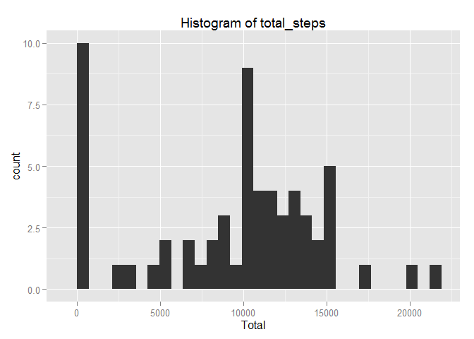
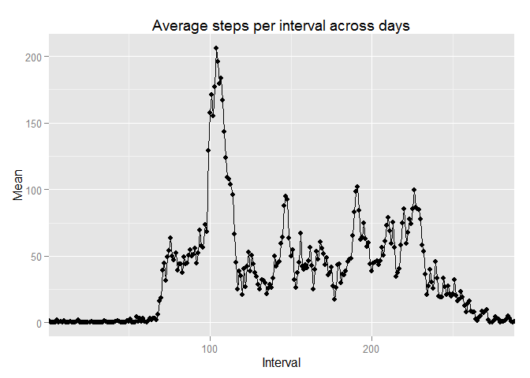
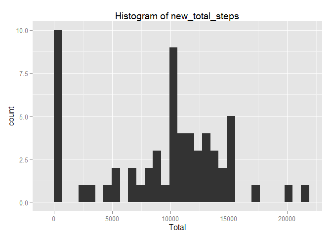
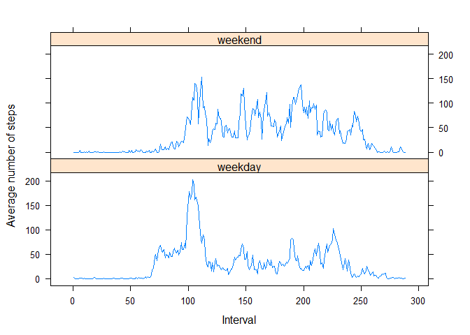

# Reproducible Research: Peer Assessment 1
Pietro Franzero  
  

  
Before we begin, let's set echo to TRUE in the options, just to make sure the
code is easy to follow:
  

```r
    opts_chunk$set(echo = TRUE, results = "markup")
```
  
  
## Loading and preprocessing the data
  
First, we should load the data:
  

```r
    unzip("activity.zip")
    data <- read.csv("activity.csv", header = TRUE)
```
  
Now, we can have a look at the data structure:
  

```r
    str(data)
```

```
## 'data.frame':	17568 obs. of  3 variables:
##  $ steps   : int  NA NA NA NA NA NA NA NA NA NA ...
##  $ date    : Factor w/ 61 levels "2012-10-01","2012-10-02",..: 1 1 1 1 1 1 1 1 1 1 ...
##  $ interval: int  0 5 10 15 20 25 30 35 40 45 ...
```
  
We can see that the date variable is a factor. Let's convert it to Date type:
  

```r
    data$date <- as.Date(data$date, format = "%Y-%m-%d")
```
  
The interval variable is an integer. It will be easier to handle if we break it into 5-minute intervals (where 0'-5' is the 1st interval, 5'-10' is the 2nd interval and so on):
  

```r
    data$five_min_int <- (data$interval %/% 100)*(60/5) + (data$interval %% 100)*(1/5) + 1
```
  
Now, we can move on to the questions.
  
  
  
## Part 1 - What is mean total number of steps taken per day?
  
### Total number of steps per day (total_steps)
  
**For this part of the assignment, you can ignore the missing values in the dataset.**
  
**1. Calculate the total number of steps taken per day.**
    
We can calculate the total number of steps per day using sapply and split (which is equivalent to tapply):
  

```r
    total_steps <- sapply(split(data$steps, data$date), sum, na.rm = TRUE)
    total_steps <- as.data.frame(as.table(total_steps))
    colnames(total_steps) <- c("Date","Total")
```
  
  
### Histogram of total_steps
  
**2.If you do not understand the difference between a histogram and a barplot, research the difference between them. Make a histogram of the total number of steps taken each day.**
  
Now, let's make a histogram of total_steps to have an idea of the frequency distribution. I am using ggplot2, so I am going to load the package:
  

```r
    library(ggplot2)
    qplot(x = Total, data = total_steps, geom = "histogram", main = "Histogram of total_steps")
```

```
## stat_bin: binwidth defaulted to range/30. Use 'binwidth = x' to adjust this.
```

 
  
Note that I am using the default bin widths.
  
  
### Calculation of mean and median of total_steps
  
**3.Calculate and report the mean and median of the total number of steps taken per day.**
  
Now, we can calculate the mean and median of total_steps:
  

```r
    steps_mean <- mean(total_steps$Total, na.rm = TRUE)
    steps_median <- median(total_steps$Total, na.rm = TRUE)
```
  
So we can see the mean is 9354.2295082 and the median is 10395.
  
  
  
## Part 2 - What is the average daily activity pattern?
  
### Calculation
  
**1.Make a time series plot (i.e. type = "l") of the 5-minute interval (x-axis) and the average number of steps taken, averaged across all days (y-axis)**
  
Now we have to calculate the average number of steps taken in each interval (x-axis) across all days (y-axis) and make a time series plot (i.e. a line chart).
  
To do so, let's first calculate the series we want to plot:
  

```r
    int_mean <- sapply(split(data$steps, data$five_min_int), mean, na.rm = TRUE)
    int_mean <- as.data.frame(as.table(int_mean))
    colnames(int_mean) <- c("Interval","Mean")
    int_mean$Interval <- as.integer(int_mean$Interval)
```
  
Note that, as we are going to plot a time series chart, the Interval variable must not be a factor, so we converted it to integer.
  
Now we can make the plot:
  

```r
    ggplot(int_mean, aes(Interval, Mean, group = 1)) +
      geom_point() +
      geom_line() +
      coord_cartesian(xlim = c(min(int_mean$Interval), max(int_mean$Interval))) +
      ggtitle("Average steps per interval across days")
```

 
  
  
### Which interval is the maximum?
  
**2. Which 5-minute interval, on average across all the days in the dataset, contains the maximum number of steps?**
  

```r
  x <- int_mean$Interval[int_mean = max(int_mean$Mean)]
  y <- (((x-1) %/% 12)*100) + (((x-1) %% 12)*5)
```
  
In this case, the interval with the maximum number of steps begins at 1705.
  
  
  
## Part 3 - Imputing missing values
  
### Counting the number of missing values (NAs)
  
**Note that there are a number of days/intervals where there are missing values (coded as NA). The presence of missing days may introduce bias into some calculations or summaries of the data.**
  
**1. Calculate and report the total number of missing values in the dataset (i.e. the total number of rows with NAs)**
  
Let's calculate the total number of NAs in the steps and store results in a data frame df:
  

```r
    df <- data.frame(NA_steps = sum(is.na(data$steps)),NA_date = sum(is.na(data$date)), NA_interval = sum(is.na(data$interval)), row.names = "Summary")
```
  
  
### Replacing missing values (NAs)
  
**2. Devise a strategy for filling in all of the missing values in the dataset. The strategy does not need to be sophisticated. For example, you could use the mean/median for that day, or the mean for that 5-minute interval, etc.**
  
**3. Create a new dataset that is equal to the original dataset but with the missing data filled in.**
  
Now, we must replace the missing values. I am going to use the following strategy:
  
i) for days where the sum of steps (ex-NA) equals zero, I will replace the NA for 0;
  
ii) for the remaining days, I will replace with the average of the 5' interval across all days;
  
To accomplish such, I am going to build a loop to look for the sum of steps in the day (using the "total_steps" data frame from part 1) and for the mean for the interval (using the "int_mean" data frame from part 2):
  

```r
    new_data <- data
    
    total_steps$Date <- as.Date(total_steps$Date, format = "%Y-%m-%d")
    
    for(i in 1:nrow(new_data)) {
    
      if (is.na(new_data$steps[i])) {
      
        if(total_steps[which(new_data$date[i] == total_steps$Date),]$Total == 0){
        
          new_data$steps[i] <- 0
          
        } else {
        
          new_data$steps[i] <- int_mean[which(new_data$five_min_int[i] == int_mean$Interval), ]$Mean
        
        }
      }  
    }
```
  
  
### Plotting new histogram and recalculating mean and median
  
**4. Make a histogram of the total number of steps taken each day and Calculate and report the mean and median total number of steps taken per day. Do these values differ from the estimates from the first part of the assignment? What is the impact of imputing missing data on the estimates of the total daily number of steps?**
  
Now, we can plot a histogram of the new data (new_total_steps):
  

```r
    new_total_steps <- sapply(split(data$steps, data$date), sum, na.rm = TRUE)
    new_total_steps <- as.data.frame(as.table(new_total_steps))
    colnames(new_total_steps) <- c("Date","Total")
    qplot(x = Total, data = new_total_steps, geom = "histogram", main = "Histogram of new_total_steps")
```

```
## stat_bin: binwidth defaulted to range/30. Use 'binwidth = x' to adjust this.
```

 
  
Calculating the new mean and median of new_total_steps:
  

```r
    new_steps_mean <- mean(new_total_steps$Total, na.rm = TRUE)
    new_steps_median <- median(new_total_steps$Total, na.rm = TRUE)
```
  
_We can see the mean is 9354.2295082 and the median is 10395. The fact that there was no change in the numbers indicate that all days with missing data were days in which the sum of steps had (previously) been 0._
  
  
  
## Part 4 - Differences in activity patterns between weekdays and weekends
  
**1. Create a new factor variable in the dataset with two levels - "weekday" and "weekend" indicating whether a given date is a weekday or weekend day.**
  
First, let's add the factor weekdays to the (new) data set:
  

```r
    new_data$weekdays <- factor(weekdays(new_data$date))
    levels(new_data$weekdays) <- list(weekday = c("Monday","Tuesday","Wednesday","Thursday","Friday"), weekend = c("Saturday","Sunday"))
```
  
**2. Make a panel plot containing a time series plot (i.e. type = "l") of the 5-minute interval (x-axis) and the average number of steps taken, averaged across all weekday days or weekend days (y-axis). See the README file in the GitHub repository to see an example of what this plot should look like using simulated data.**
  
Now, we can calculate the new mean across each interval:
  

```r
    new_int_mean <- aggregate(new_data$steps, 
                      list(Interval = new_data$five_min_int, 
                        Weekdays = new_data$weekdays),
                      mean)
    colnames(new_int_mean) <- c("Interval","Weekdays","Mean")
    new_int_mean$Interval <- as.integer(new_int_mean$Interval)
```
  
Finally, we can make the plot comparing average steps per interval across weekdays and weekends. This time, I am going to use lattice:
  

```r
    library(lattice)
    xyplot(new_int_mean$Mean ~ new_int_mean$Interval | new_int_mean$Weekdays, layout = c(1,2), type = "l", xlab = "Interval", ylab = "Average number of steps")
```

 
